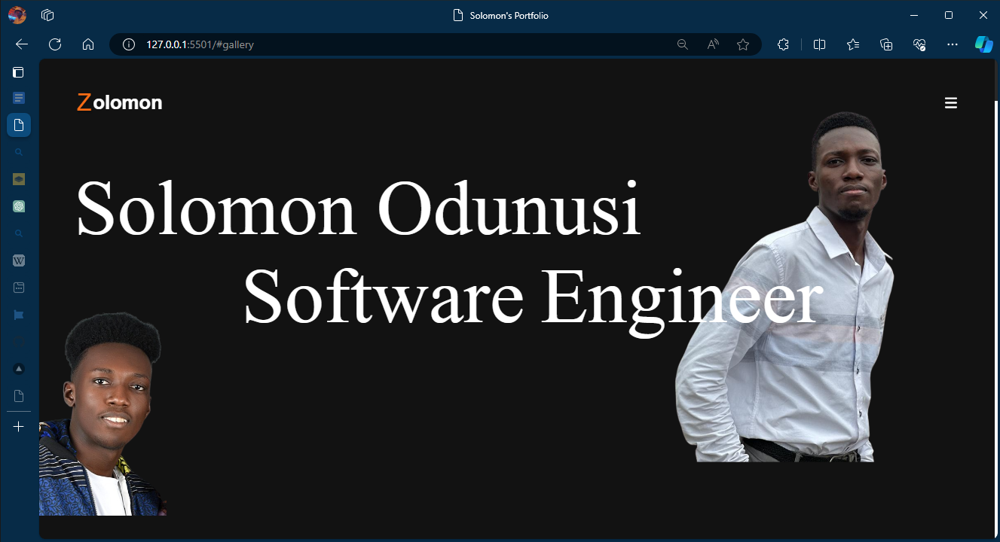
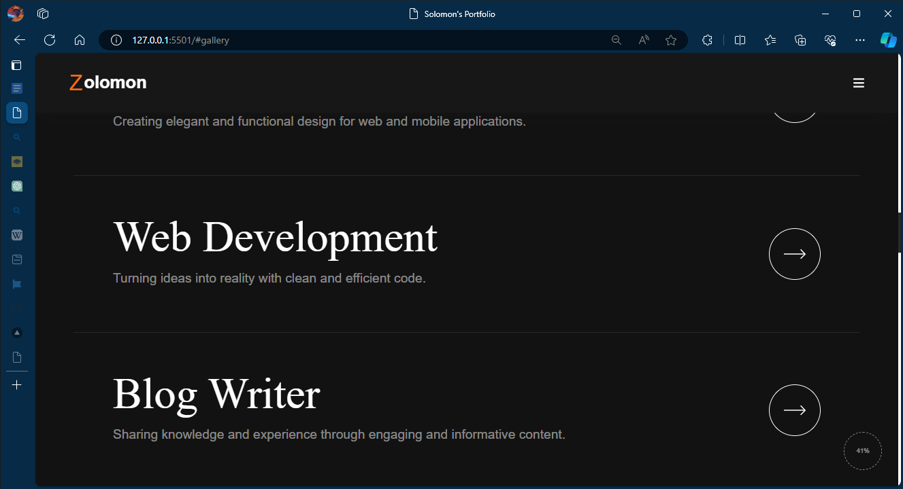

# Solomon's Portfolio

Explore My Portfolio Website.

## Table of Contents

- [Introduction](#introduction)
- [Gallery](#gallery)
- [Features](#features)
- [Contributing](#contributing)
- [License](#license)

## Introduction

My personal portfolio website serves as a digital showcase of my skills, projects, and experiences. Its primary purpose is to introduce myself to potential employers, clients, or collaborators and highlight the value I can bring to their projects or organizations. The website provides visitors with an overview of my background, expertise, and accomplishments, allowing them to learn more about me and my work.

## Gallery

## Features

List the main features of your project. You can use bullet points or a numbered list to highlight each feature.

- About Me Section
- Portfolio Section
- Skills Section
- Contact Section

## Thank You

Thank you for taking the time to explore my portfolio website. I appreciate your interest in my work and hope that you found the information provided valuable. If you have any questions or would like to discuss potential collaborations, please feel free to reach out to me through the contact information provided in the section below.

I look forward to connecting with you and exploring opportunities to work together.

Best regards,
Solomon